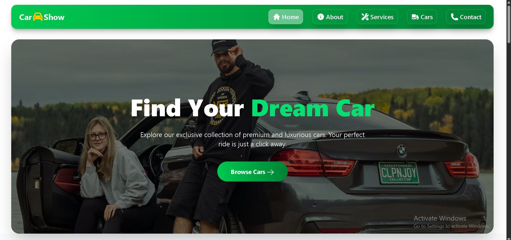
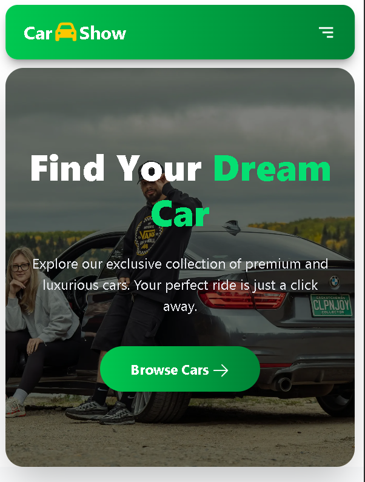

🚗 Car Show - Premium Automobile Showcase
A modern, high-performance automobile showcase application built with Next.js 16, Tailwind CSS, and Framer Motion. This project features a premium UI, interactive car cards with modal details, and a fully responsive layout.

🚀 Live Demo
Check out the live site: https://car-show-ruddy.vercel.app/

✨ Features
Modern Hero Section: Eye-catching design with smooth animations.

Car Showcase: Grid layout featuring premium vehicles.

Interactive Modals: Detailed view for each car using AnimatePresence.

About Section: Company vision and stats with scrolling animations.

Contact Form: Functional and interactive contact section for inquiries.

Responsive Design: Fully optimized for Mobile, Tablet, and Desktop.

Smooth Navigation: Custom sticky navbar with a mobile-friendly sidebar.

🛠️ Tech Stack
Framework: Next.js (App Router)

Styling: Tailwind CSS

Animations: Framer Motion

Icons: React Icons

Language: TypeScript

📦 Getting Started
Follow these steps to run the project locally:

Clone the repository:

Bash
git clone https://github.com/rasel701/car-show.git
Navigate to the project directory:

Bash
cd car-show
Install dependencies:

Bash
npm install
Run the development server:

Bash
npm run dev
Build for production:

Bash
npm run build
📸 Screenshots
| Desktop View | Mobile View |
| :---: | :---: |
|  |  |

👤 Author
Md Rasel
Role: Junior Frontend & MERN Stack Developer

📄 License
This project is licensed under the MIT License.
